# Twelve Creative Website

The public marketing website for Twelve Creative and its built-in administrative content management system, built on Next.js with the App Router. This is the only consumer-facing application in the project: every visitor-facing page and every admin panel screen is served from this single Next.js deployment, rendered against content stored in the separate [Twelve Creative Server](../twelve-creative-server) API.

This document describes the system as it exists in the codebase: the rendering and data-fetching architecture, the routing structure, the component system, the design system, and the deployment pipeline. Every diagram in this document is followed by a written explanation of what it shows.

## Table of Contents

1. [Overview](#overview)
2. [Technology Stack](#technology-stack)
3. [System Architecture](#system-architecture)
4. [Routing Architecture](#routing-architecture)
5. [Data Fetching and Rendering](#data-fetching-and-rendering)
6. [Component Architecture](#component-architecture)
7. [Admin Panel Authentication](#admin-panel-authentication)
8. [Admin Content Workflow](#admin-content-workflow)
9. [Design System](#design-system)
10. [Video and Media Handling](#video-and-media-handling)
11. [State Management](#state-management)
12. [Project Structure](#project-structure)
13. [Environment Variables](#environment-variables)
14. [Getting Started](#getting-started)
15. [Available Scripts](#available-scripts)
16. [Build and Quality Gates](#build-and-quality-gates)
17. [Deployment](#deployment)

## Overview

The application serves two distinct audiences from one Next.js codebase. The public site — home, about, what we build, industries, works, process, blog, FAQ, contact, and the legal pages — is rendered from content that editors manage entirely through the admin panel; there is no content hardcoded into the frontend beyond the copy used as a fallback when a piece of content has not yet been set. The admin panel, mounted at `/admin`, is a full content management interface: every collection exposed by the backend API has a corresponding list, create, and edit screen, with search, filtering, pagination, and drag-to-reorder where the content is ordered.

Almost the entire application is server-rendered. Public pages and admin list and edit screens are Next.js Server Components that call the backend API directly during rendering; there is no client-side data-fetching library standing between a page and the API for the primary read path. Mutations — creating, updating, deleting, and reordering content from the admin panel — go through Next.js Server Actions, which run on the server, call the backend API with the admin's credentials, and then tell Next.js which parts of the page cache to invalidate. The result is that almost no application code runs a `fetch` call in the browser; the browser receives already-rendered HTML and only becomes interactive for genuinely interactive concerns such as image uploads, video playback, and drag-and-drop reordering.

## Technology Stack

| Concern | Choice |
| --- | --- |
| Framework | Next.js 16, App Router, Turbopack |
| Language | TypeScript |
| UI runtime | React 19 |
| Styling | Tailwind CSS 4, OKLCH-based design tokens |
| Component library | shadcn/ui, built on Radix primitives |
| Icons | Hugeicons |
| Forms | React Hook Form with Zod resolvers |
| Animation | Framer Motion, GSAP |
| Video playback | react-player |
| Carousels | Embla Carousel |
| Client-side global state | Redux Toolkit, scoped usage |
| Client-side server-state caching | TanStack Query, scoped usage |
| Package manager | pnpm |
| Process management | PM2 |
| Reverse proxy | Nginx |

## System Architecture

<div align="center">

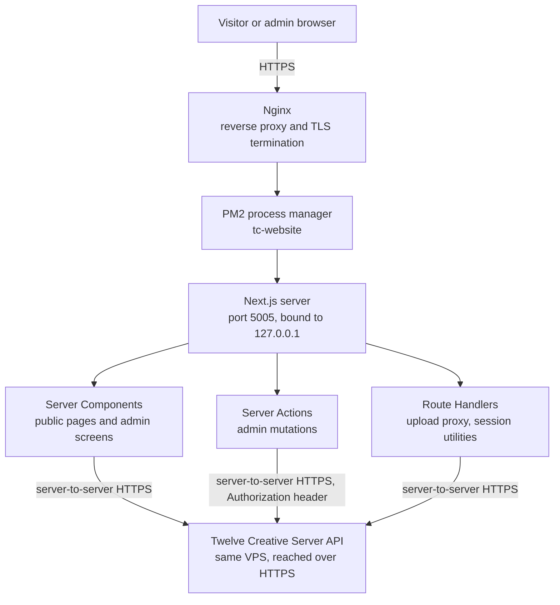

</div>

The Next.js application runs as a single PM2-managed process, never exposed directly to the internet: Nginx is the only public entry point and forwards traffic to `127.0.0.1:5005`. Every request the browser makes for a page is answered by a Server Component that itself makes a server-to-server HTTPS call to the backend API while rendering, so the API's own CORS configuration — which allows only the production website and admin origins — is never a concern for a normal page load, since the browser never talks to the API directly. The same is true of admin mutations: a Server Action runs entirely on the Next.js server, attaches the admin's access token, and calls the backend directly. The two exceptions are a small number of Next.js Route Handlers under `src/app/api/`, used specifically where a browser needs to reach server-only logic that a Server Action's request/response shape does not fit, such as proxying a multipart file upload so that the httpOnly admin cookie never has to be readable by client-side JavaScript.

## Routing Architecture

<div align="center">

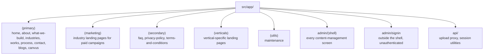

</div>

Route groups are used to give different parts of the site their own layout without affecting the URL structure. `(primary)` carries the main site header and footer and holds the pages a visitor is expected to reach through normal navigation. `(marketing)` exists specifically for paid-traffic landing pages that reuse industry content but are not linked from the main navigation. `(secondary)` and `(verticals)` are lighter-weight groups for supporting and campaign-specific pages respectively. `admin/(shell)` is its own self-contained application: every page inside it shares a sidebar-and-topbar layout and is gated behind an authentication check at the layout level, described in Admin Panel Authentication below. The sign-in page is deliberately placed outside that shell, since it is the one admin route that must render for an unauthenticated visitor. Across the whole application there are seventy-eight page routes: twenty-one on the public site and fifty-seven inside the admin panel, the latter reflecting a full create, list, and edit screen for every content type the backend exposes.

## Data Fetching and Rendering

<div align="center">

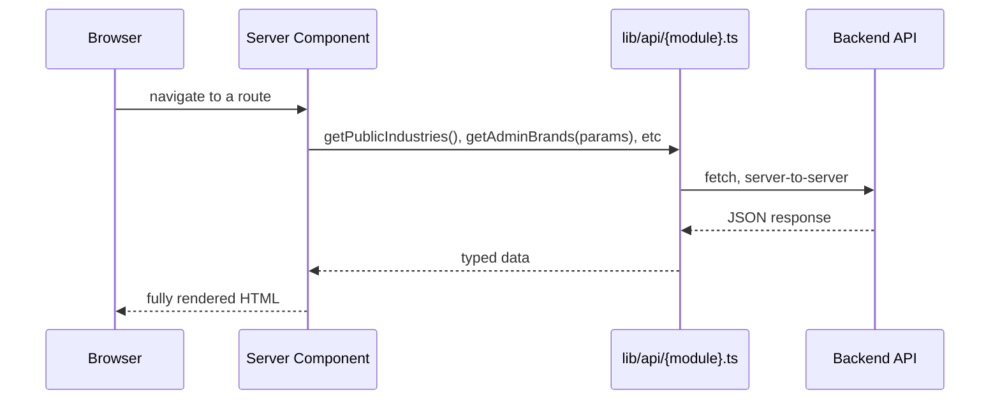

</div>

Every public page and every admin list or edit screen is an `async` Server Component that calls a plain function from `src/lib/api/{module}.ts` directly in its render body, using the standard `fetch` API against the backend's base URL. These functions are not React hooks and carry no client-side caching layer of their own; a page that needs data for three different sections calls three such functions, typically in parallel with `Promise.all`, and the resulting HTML already contains that data by the time it reaches the browser. This is the primary and by far the most common data path in the application — the overwhelming majority of pages contain no client-side data fetching at all.

<div align="center">

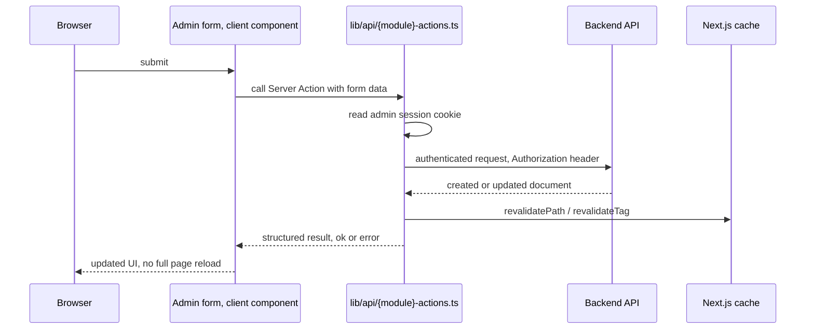

</div>

Every mutation in the admin panel — create, update, delete, restore, and reorder — is a Next.js Server Action, defined in a `src/lib/api/{module}-actions.ts` file paired one-to-one with its corresponding read module. A Server Action is a function marked `"use server"` that a client component can call directly as if it were a local function; Next.js handles the network round trip. Each action reads the admin's session server-side, attaches the access token as an `Authorization` header when calling the backend, and returns a plain `{ ok: boolean, error?: string }`-shaped result rather than throwing, so the calling form can render a clean error message instead of an unhandled exception. On success, the action calls `revalidatePath` or `revalidateTag` so that the next render of the affected page — most often the list screen the admin is about to be redirected back to — reflects the change without a manual refresh. This pairing is the reason the two file suffixes exist side by side throughout `src/lib/api/`: the plain file is a read path called during rendering, and the `-actions` file is a write path called from a form's submit handler.

## Component Architecture

<div align="center">

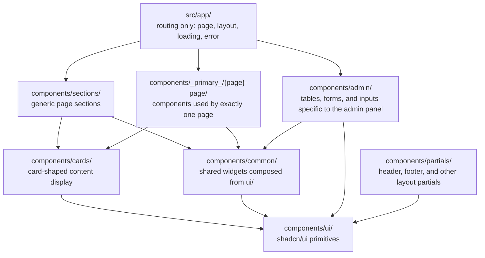

</div>

Components are organized by how broadly they are reused rather than by which page they happen to appear on first. `src/app/` is reserved strictly for routing files; every visual element lives under `src/components/`. `ui/` is the shadcn/ui primitive layer — buttons, dialogs, cards, form fields, tables — and every other directory is expected to compose from it rather than reaching for a raw styled `div` where a primitive already exists. `sections/` holds generic, reusable page sections; `components/_primary_/{page}-page/` holds compositions specific to a single page, such as the home page's hero or its industries carousel, that would not make sense to reuse elsewhere. `cards/` and `common/` hold smaller shared pieces, and `admin/` holds the tables, form inputs, and layout chrome specific to the content management interface. The codebase contains one hundred and forty-nine component files in total.

## Admin Panel Authentication

<div align="center">

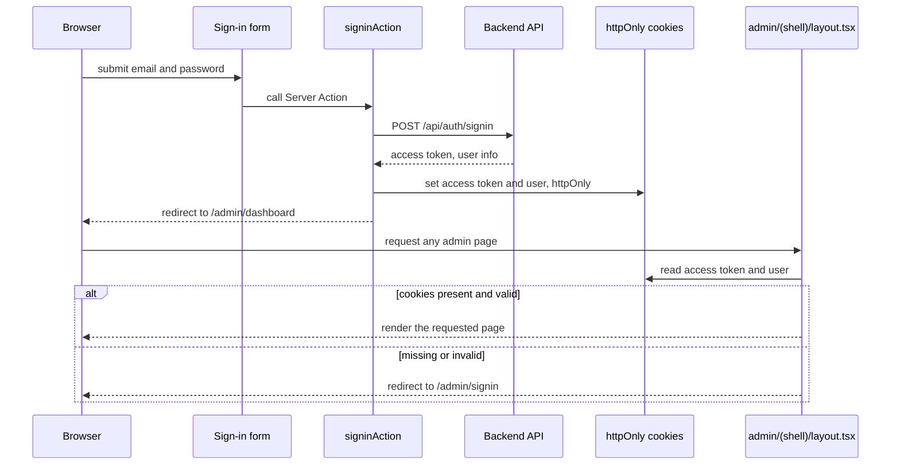

</div>

Admin authentication has no Next.js Edge Middleware involved; the codebase deliberately has no `middleware.ts`. Instead, the gate is a single server-side check performed at the top of `admin/(shell)/layout.tsx`, which every admin page renders inside. A successful sign-in is handled by a Server Action that calls the backend's `/api/auth/signin` endpoint, receives an access token, and writes it into an httpOnly cookie alongside a second cookie holding the user's basic profile — httpOnly specifically so that the access token is never readable by client-side JavaScript, closing off an entire class of token-theft vectors. Every subsequent request for an admin page runs `requireAdminSession()` inside the shell layout before rendering any child page, which reads those cookies, and either allows the render to proceed or redirects to the sign-in page. Because this check lives in the layout rather than in middleware, it runs as an ordinary part of the Server Component render tree and has direct access to the same cookie store that Server Actions use to attach the `Authorization` header on outgoing backend requests.

## Admin Content Workflow

<div align="center">

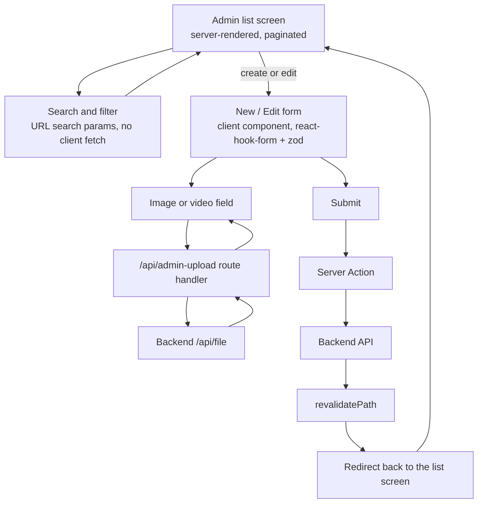

</div>

Every admin content type follows the same shape: a paginated, searchable list screen with a "New" action and a per-row "Edit" action, and a form screen that handles both creation and editing. Search and filters are encoded as URL search parameters and read directly by the Server Component, rather than triggering a client-side fetch, so a filtered or paginated list view is a shareable, bookmarkable URL. Image and video fields default to a URL input, with an "Upload" mode that switches to a native file input; choosing a file posts it to the `/api/admin-upload` Route Handler described in System Architecture, which forwards it to the backend's file endpoint using the admin's credentials read server-side, and returns the resulting public URL back into the form field. Submitting the form calls the module's Server Action, which on success revalidates the list screen's cached render and redirects back to it, so the newly created or edited item is visible immediately without a manual refresh.

## Design System

<div align="center">

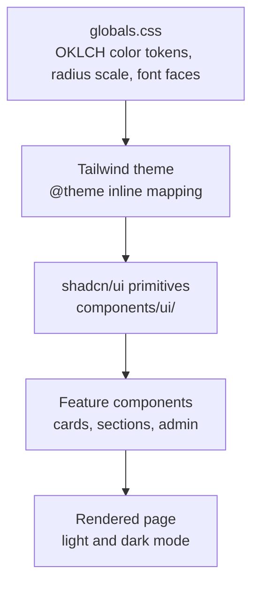

</div>

The design system is token-first: every color used anywhere in the application is a semantic OKLCH custom property defined once in `globals.css` — `background`, `foreground`, `card`, `primary`, `accent`, and their `dark` mode counterparts — rather than a hardcoded hex value or a generic Tailwind color class. The brand identity these tokens carry is a warm orange primary (`#E96A2C`), a cream background (`#EAEAE4`), and a near-black teal foreground (`#131C20`), each expressed as an OKLCH value for perceptually consistent color mixing and dark-mode inversion. Tailwind's `@theme inline` block maps these custom properties into Tailwind's own color scale, which is what lets every component reach for `bg-primary` or `text-muted-foreground` rather than a literal color. shadcn/ui's primitives in `components/ui/` are themed entirely through this same token set, and every feature component is expected to compose from those primitives rather than styling a raw element by hand. Radius is similarly tokenized on a three-step scale — small for chips and tags, medium for inputs, large for buttons — kept consistent across the whole interface rather than chosen ad hoc per component. Typography is built on a licensed variable font, Object Sans, loaded through `@font-face` declarations and mapped to both `--font-sans` and `--font-heading`.

## Video and Media Handling

<div align="center">

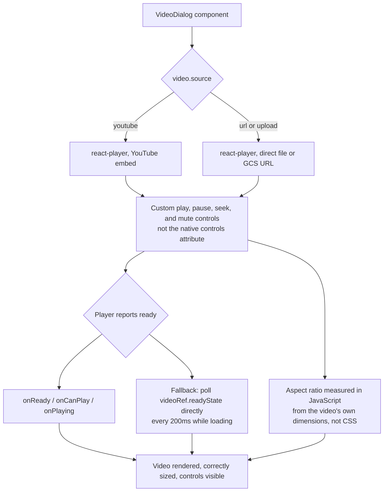

</div>

Every video surfaced anywhere on the site — testimonials, industry reels, featured project clips, case study outcome videos — passes through one shared `VideoDialog` component, so that a fix or a design change made once applies everywhere a video can be played. A video reference throughout the data model is a `{ source, value }` pair, and the dialog resolves a YouTube source into a `react-player` YouTube embed and a `url` or `upload` source into a direct player, behind the same custom control bar either way. The controls are deliberately not the browser's native `controls` attribute: on real iOS Safari, the native control skin does not respect the dialog's rounded, clipped container and renders oversized, a defect invisible to any Chromium-based testing, including Chrome's own device emulation, and only reproducible against a real WebKit engine. Because the same real-device testing found that `react-player`'s own `onReady`, `onCanPlay`, and `onPlaying` callbacks did not reliably fire on every device, the dialog also polls the underlying video element's `readyState` directly as a fallback while a video is loading, so the custom controls still appear even when the event-based signal is silent. The dialog's box size is measured in JavaScript from the video's actual `videoWidth` and `videoHeight` once metadata loads, rather than expressed as CSS `aspect-ratio`, because a CSS Grid ancestor's auto-sizing pass was found to clamp the box before the ratio could resolve; a portrait reel and a landscape case-study clip both size correctly inside the same component as a result.

## State Management

<div align="center">

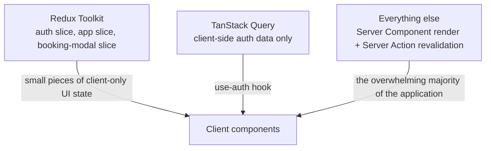

</div>

Both Redux Toolkit and TanStack Query are present in the dependency graph, but neither is the primary way data reaches the screen; that role belongs to the Server Component and Server Action pattern described above. Redux is scoped to a small number of slices holding genuinely client-only UI state: authentication state mirrored for client components, general application UI state, and the state behind the booking modal. TanStack Query's only usage is inside a single `use-auth` hook, providing client-side caching for the one piece of authentication data a client component needs to read reactively. Neither library is used to fetch or cache the content that makes up the public website or the admin panel's lists and forms.

## Project Structure

```text
src/
  app/                       Routing only: page, layout, loading, and error files
    (primary)/                 Main site pages
    (marketing)/                Campaign landing pages
    (secondary)/                Supporting pages
    (verticals)/                 Vertical-specific landing pages
    (utils)/                     Maintenance page
    admin/(shell)/               Every admin content-management screen
    admin/signin/                 Admin sign-in, outside the shell
    api/                          Route Handlers: upload proxy, session utilities
  components/
    ui/                        shadcn/ui primitives
    common/                    Shared widgets composed from ui/
    sections/                  Generic, reusable page sections
    _primary_/{page}-page/       Components specific to a single page
    cards/                     Card-shaped content display
    admin/                     Admin tables, forms, and inputs
    partials/                  Header, footer, and other layout partials
    industry/                    Industry-specific composition
    legal/                       Legal page rendering
    icons/                       Custom SVG icon components
  lib/
    api/                       One read module and one actions module per backend resource
    admin/                     Session helpers, upload client, admin-only configuration
    media/                     Video and image resolution helpers
  redux/                     Store and slices
  hooks/                     Shared React hooks
  providers/                 Top-level React context providers
  data/                      Static fallback data, pure data only, no styling
  config/                    env.ts, api.ts, site.ts, constant.ts, features.ts
```

## Environment Variables

Every environment variable is read through `src/config/env.ts` and re-exported as a single `ENV` object.

| Variable | Purpose |
| --- | --- |
| `NEXT_PUBLIC_APP_URL` | The site's own public origin, used for canonical and Open Graph metadata |
| `NEXT_PUBLIC_API_URL` | Browser-visible API base, used only to construct static asset URLs, never for a client-side data fetch |
| `API_URL` | Server-side backend base URL, used by every Server Component and Server Action |
| `SERVER_API_KEY` | Shared secret attached to trusted Next.js-to-backend requests |
| `ADMIN_ACCESS_COOKIE_MAX_AGE_SECONDS` | Lifetime of the admin access cookie, mirroring the backend's access token expiry |

A complete template is kept at `.env.example` in the repository root.

## Getting Started

The project requires Node.js 24 and pnpm 10, pinned in `package.json` under `engines` and `packageManager`.

```bash
pnpm install
cp .env.example .env
# Point API_URL and NEXT_PUBLIC_API_URL at a running instance of the backend.
pnpm dev
```

The development server runs on Turbopack. Because every page and every admin screen renders against live data from the backend, the backend must be reachable — either a locally running instance or the deployed production API — before pages will render meaningfully.

## Available Scripts

| Script | Purpose |
| --- | --- |
| `pnpm dev` | Run the development server with Turbopack |
| `pnpm build` | Produce a production build |
| `pnpm start` | Run the production build |
| `pnpm lint` | Run ESLint |

## Build and Quality Gates

The project is checked with TypeScript's compiler in strict mode and ESLint, both run as part of every deploy's build step; a build that fails either does not produce a deployable artifact, and the previous release stays live, as described in Deployment below. There is no automated frontend test suite at this time; correctness for UI and interaction changes is verified manually against a running instance, including, where a defect is specific to a rendering engine, against real WebKit rather than Chromium's device emulation, which has been found insufficient to reproduce certain iOS Safari-only defects.

## Deployment

<div align="center">

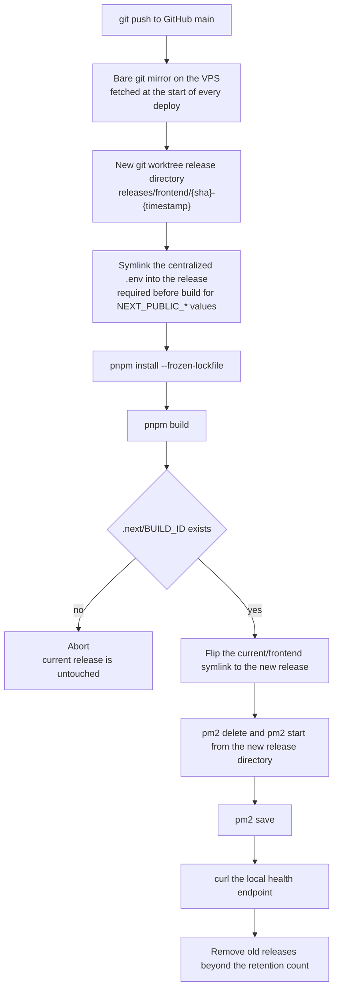

</div>

Deployment uses the same atomic, self-hosted pipeline as the backend, driven by the same shell script (`deploy.sh`) run on the VPS, with the frontend and backend deployable independently or together. Each deploy fetches the latest `main` branch into a bare git mirror, checks it out into a brand new directory using a git worktree, symlinks in the centralized environment file — before the build runs, since Next.js inlines `NEXT_PUBLIC_*` values into the client bundle at build time rather than reading them at request time — installs dependencies, and builds. Only if the build actually produces a `.next/BUILD_ID` does the script touch anything live: it repoints a `current` symlink at the new release and restarts the PM2 process from that new directory rather than reloading the existing one in place, since PM2's reload does not repoint an already-running process to a new working directory. A failed build leaves the previously deployed release running untouched. In production, the application runs as a single PM2-managed process named `tc-website`, listening on `127.0.0.1:5005`, with Nginx as the only process with a public-facing listener, identical in shape to the backend's own deployment described in its own README.
